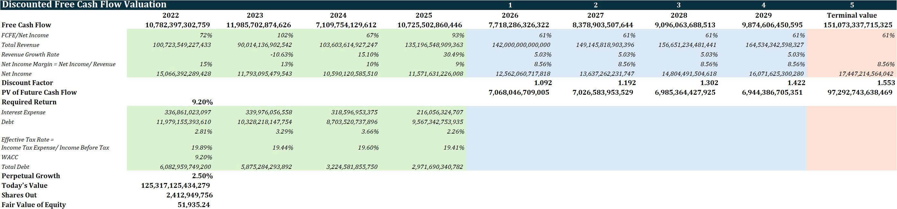

# PV Gas DCF Valuation Model

A financial valuation project analyzing PV Gas using the Discounted Cash Flow (DCF) method in Excel.

## Project Overview

This project was developed to estimate the intrinsic equity value of PV Gas by forecasting future free cash flows and discounting them back to present value using WACC.

The model includes:
- Historical financial analysis
- Revenue forecasting
- Net income projection
- Free Cash Flow (FCF) estimation
- CAPM & WACC calculation
- Terminal value estimation
- Equity valuation per share

---

# Company

Company analyzed:
- PV Gas (HOSE: GAS)

Sector:
- Oil & Gas / Energy Utilities

---

# Valuation Methodology

## Discounted Cash Flow (DCF)

The valuation uses the following framework:

### 1. Forecast Financial Performance
Projected:
- Revenue growth
- Net income margin
- Free cash flow

### 2. Estimate Discount Rate (WACC)

Using:
- Risk-free rate
- Beta
- Expected market return
- Cost of debt
- Capital structure

### 3. Calculate Present Value of Future Cash Flows

DCF Formula:

PV = FCF / (1 + r)^t

Where:
- PV = Present Value
- FCF = Free Cash Flow
- r = Required Return (WACC)
- t = Time Period

### 4. Calculate Terminal Value

TV = FCFE * (1 + g) / (WACC - g)

Where:
- TV = Terminal Value
- FCFE = Free Cash Flow Equity
- g = Perpetual Growth

---

# Key Assumptions

| Assumption | Value |
|---|---|
| WACC | 9.20% |
| Perpetual Growth Rate | 2.50% |
| Beta | 0.71 |
| Risk-Free Rate | 4.37% |
| Expected Market Return | 11.50% |

---

# Valuation Result

| Metric | Value |
|---|---|
| Enterprise Value | 125.3 Trillion VND |
| Shares Outstanding | 2.41 Billion |
| Fair Value per Share | 51,935 VND |

---

# Tools Used

- Microsoft Excel
- DCF Valuation
- CAPM
- Financial Statement Analysis

---

# Data Sources

Financial data collected from:
- PV Gas annual reports
- Vietstock
- Public financial statements

---

# Files Included

| File | Description |
|---|---|
| GAS_DCF_Valuation_Model.xlsx | Main financial model |
| README.md | Project documentation |

---

# Key Learnings

Through this project, I practiced:
- Equity research fundamentals
- Financial modeling
- Business forecasting
- Valuation techniques
- Analytical thinking

---

# Disclaimer

This project is for educational and portfolio purposes only and should not be considered investment advice.

---

## Model Preview

